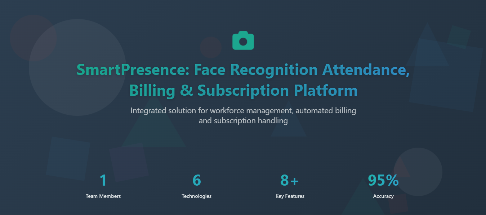

# SmartPresence – Face Recognition Attendance, Billing & Subscription Platform

An advanced hybrid attendance management system that combines a **PHP-based Web Portal** with a **Python Face Recognition Application**. The platform enables organizations to manage employees, record attendance using facial recognition, generate wage muster reports, and maintain payroll-ready records using a centralized **MySQL database**.



---

## 📖 Table of Contents

* [Project Overview](#-project-overview)
* [Features](#-features)
* [Project Workflow](#-project-workflow)
* [Web Portal](#-web-portal)
* [Python Face Recognition System](#-python-face-recognition-system)
* [Generated Reports](#-generated-reports)
* [Technology Stack](#-technology-stack)
* [Complete Workflow](#-complete-workflow)

---

# 📘 Project Overview

SmartPresence is designed for organizations that require a complete attendance and payroll solution.

The system provides:

* Organization Registration & Login
* OTP Verification
* Employee Management
* Face Recognition Attendance
* Automatic Model Training
* Attendance Report Generation
* Wage Muster Generation
* Payroll-Ready Excel Reports
* Voice Confirmation during Attendance

All information is securely stored in a centralized **MySQL database** shared by both the PHP web portal and the Python application.

---

# 🏗️ System Architecture

The project consists of two main modules.

## 🌐 Web Portal

Built using:

* HTML5
* CSS3
* JavaScript
* Bootstrap
* PHP
* MySQL

Functions:

* Organization Registration
* Login
* HR Dashboard
* Employee Management
* Wage Muster Generation
* Report Download

---

## 🧠 Face Recognition Application

Built using:

* Python
* Tkinter
* OpenCV
* Dlib
* Pandas
* OpenPyXL
* pyttsx3

Functions:

* Face Registration
* Automatic Model Training
* Real-Time Face Recognition
* Attendance Recording
* Voice Feedback

---

# ✨ Features

### Organization Module

* Organization Registration
* Secure Login
* OTP Verification
* Forgot Password
* Password Hashing

### HR Module

* Add Employee
* Search Employee
* Edit Employee
* Delete Employee
* Employee Verification via OTP

### Face Recognition Module

* Capture Employee Images
* Automatic Face Model Training
* Real-Time Attendance
* Voice Confirmation

### Payroll Module

* Attendance Excel Generation
* Joining Record Generation
* Wage Muster Generation
* Payroll Ready Reports

---

# 🚀 Project Workflow

## 1. Start the Web Portal

Open:

```text
start.html
```

From here organizations can:

* Register
* Login

---

## 2. Organization Registration

Enter:

* Organization Name
* Email Address
* Mobile Number
* Password

The system sends an OTP to the registered mobile number using the **Renflair SMS Gateway API**.

After successful verification, the organization details are saved in the MySQL database.

---

## 3. Organization Login

Login using the registered:

* Email
* Password

After successful authentication, the organization dashboard opens.

---

## 4. Forgot Password

If the password is forgotten:

1. Enter the registered Email ID.
2. Enter the registered Mobile Number.
3. Verify both details.
4. Receive an OTP on the registered mobile number.
5. Verify the OTP.
6. Create a new password.
7. Password is stored using secure password hashing.
8. Login with the updated password.

---

# 🌐 Web Portal

## Add New Employee

After logging in:

Dashboard

↓

Add New Employee

↓

HR Login

↓

Employee Registration Form

Enter:

* Employee ID
* Employee Name
* Department
* Mobile Number
* Email Address

OTP verification is completed before storing employee information in the database.

---

## Employee Management

HR can:

* Search employees
* Edit employee details
* Delete employees
* View employee information

Search filters:

* Employee ID
* Name
* Department

---

# 🧠 Python Face Recognition System

## Run the Application

```bash
python main.py
```

A Tkinter login window appears.

---

## Login

Use the same credentials created on the web portal.

This ensures that only registered organizations can access the attendance system.

---

## Face Registration

Click:

**Add Employee**

Enter:

* Employee ID
* Employee Name

Both values must exactly match the MySQL database.

Click:

**Capture Image**

The system automatically:

* Opens the webcam
* Captures 30 face images
* Saves images in:

```text
images/
```

* Trains the recognition model automatically

---

## Attendance

Click:

**Take Attendance**

The application:

* Starts webcam
* Detects faces
* Recognizes employees
* Marks attendance automatically
* Gives voice confirmation

Attendance includes:

* Employee ID
* Employee Name
* Date
* Time

Attendance reports are stored in:

```text
php_backend/attendance_reports/
```

---

## Joining Record

Whenever a new employee is registered:

A joining record Excel file is automatically generated.

This maintains a permanent log of employee registrations.

---

# 💰 Wage Muster Generation

Open the **Wage Muster** section in the HR Dashboard.

Steps:

1. Select or upload the attendance Excel file.
2. Click **Generate Wage Muster**.
3. The system automatically:

   * Reads attendance records
   * Calculates working days
   * Calculates present days
   * Computes salary and wage details
   * Generates a formatted Wage Muster Excel report

Generated reports are stored in:

```text
php_backend/wage_muster_generator/generated/
```

These reports are ready for payroll processing.

---

# 📂 Generated Reports

The system generates the following files automatically:

| Report                  | Description                 |
| ----------------------- | --------------------------- |
| Attendance Report       | Daily attendance records    |
| Employee Joining Record | Employee joining history    |
| Wage Muster Report      | Payroll-ready salary report |

---

# 💻 Technology Stack

| Component        | Technology                         |
| ---------------- | ---------------------------------- |
| Frontend         | HTML5, CSS3, JavaScript, Bootstrap |
| Web Backend      | PHP                                |
| AI Backend       | Python 3.8+                        |
| Database         | MySQL                              |
| Face Recognition | OpenCV, Dlib                       |
| GUI              | Tkinter                            |
| Voice Feedback   | pyttsx3                            |
| Excel Reports    | Pandas, OpenPyXL                   |
| PDF Support      | ReportLab                          |
| OTP Service      | Renflair SMS Gateway API           |
| Local Server     | XAMPP / WAMP                       |

---

# ⚠️ Important Notes

* Ensure the webcam is properly connected.
* Good lighting improves face recognition accuracy.
* XAMPP/WAMP must be running before launching the Python application.
* PHP and Python must use the same MySQL database.
* A valid Renflair SMS Gateway API key is required for OTP services.
* Retrain the face recognition model whenever a new employee is added.
* Wage Muster reports can only be generated after attendance records are available.

---

# 🔄 Complete Workflow

```text
Organization Registration
        │
        ▼
OTP Verification
        │
        ▼
Organization Login
        │
        ▼
HR Login
        │
        ▼
Employee Registration
        │
        ▼
Employee OTP Verification
        │
        ▼
Employee Stored in MySQL
        │
        ▼
Python Face Registration
        │
        ▼
Automatic Model Training
        │
        ▼
Real-Time Face Recognition
        │
        ▼
Attendance Recorded
        │
        ▼
Attendance Excel Generated
        │
        ▼
Wage Muster Generated
        │
        ▼
Payroll Ready Report
```

---

# 📌 Summary

SmartPresence provides a complete attendance and payroll ecosystem by integrating a PHP-based HR management portal with a Python-powered face recognition system. The platform automates employee attendance, maintains centralized records, generates payroll-ready reports, and simplifies workforce management through secure OTP verification and AI-based facial recognition.
